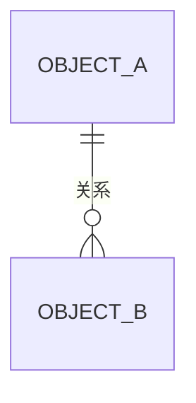
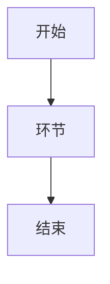
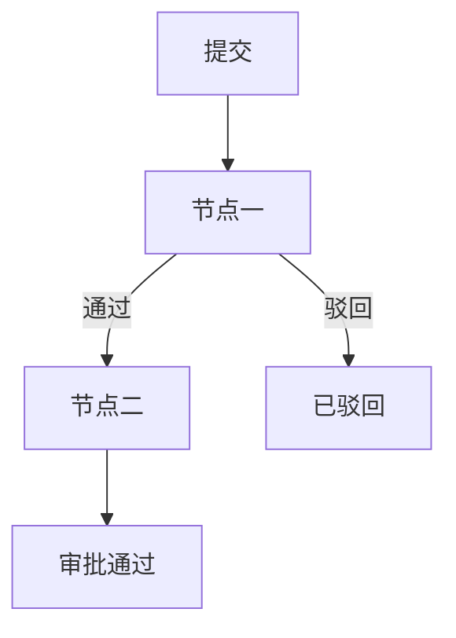

# {{SYSTEM_NAME}} 需求规格说明书

| 项目 | 内容 |
|---|---|
| 文档名称 | {{SYSTEM_NAME}}需求规格说明书 |
| 规范版本 | 软件需求编写规范 V10.0 |
| 编制日期 | {{DATE}} |
| 文档状态 | 草拟中 |

> 状态标记口径：`[AI自动补全]` 系统按行业通用做法补全、用户未修改；`[已确认]` 经用户确认或修改；`[待确认]` 尚未得到用户回复，已登记入《编制说明》待澄清清单。
> 本文档按 V10.0 固定结构（九部分 + 附录 A）组织：**没有适用内容的章节不得删除**，写明"不适用"及经确认的理由，不编内容填空。

---

# 第一部分 项目概述与范围

## 1.1 系统定位

[一句话：本系统管理什么、从哪个业务环节开始、不管理什么。]

## 1.2 业务范围

### 1.2.1 范围内

- 业务能力：
- 界面能力：
- 数据能力：
- 权限能力：

### 1.2.2 范围外

| 范围外内容 | 排除理由 |
|---|---|
| 用户账号管理、角色配置、人员与角色绑定 | 由技术底座提供（见 1.6） |
| 流程引擎自身的流程设计 / 活动定义 / 参与人角色配置 / 流程执行 / 流程任务查询 | 由技术底座提供（见 1.6） |

### 1.2.3 外部边界

- 主数据是否在本系统内维护：
- 是否存在外部系统交互：

## 1.3 业务域划分

| 业务域 | 说明 | 承载对象 |
|---|---|---|
|  |  |  |

## 1.4 核心清单索引

（用一段话指向各章清单表：对象见 2.x、功能点见 3.1.1、规则见 3.3、菜单见 8.1.2，不在此处重复汇总。）

## 1.5 角色总览

| 角色 ID | 角色 | 一句话职责 |
|---|---|---|
| ROLE-01 |  |  |

> 角色是岗位定义；角色与人员的绑定、权限配置由技术底座维护。

## 1.6 技术底座与运行前置

### 1.6.1 情形一：技术底座已就绪

| 底座能力 | 底座已提供的内容 | 本需求如何使用 |
|---|---|---|
| 用户登录 | 账号登录、会话维持，当前登录人身份 |  |
| 系统管理（用户 / 角色 / 权限 / 资源 / 菜单） | 用户维护、角色定义、角色与用户绑定、权限与资源授权、菜单配置与渲染 |  |
| 流程引擎 | 流程定义与设计器、活动与节点、参与人角色配置、流程实例推进、流程任务与待办查询 |  |

### 1.6.2 情形二：未指定技术底座时的降级实现

| 能力项 | 降级实现（要做） | 不实现（不做） |
|---|---|---|
| 用户登录 | 实现用户登录，用户信息仅含用户名、用户密码、人员编码、状态；密码加密存储 | 密码策略、登录日志、单点登录、验证码、找回密码 |
| 默认登录账号 | 内置一个默认账号 `admin`，状态启用，首次部署设定初始密码并强制首次登录修改 | 不建第二个账号、不做账号与角色关联 |
| 角色权限管理 | 不实现；菜单与功能点对默认账号全部可见可用 | 角色定义、权限配置、资源授权、菜单配置 |
| 流程引擎 | 不实现；审批降级为「单据状态流转 + 审批记录」 | 流程设计器、活动定义、参与人角色配置、流程实例引擎、流程任务与待办查询 |

### 1.6.3 与本文其余部分的关系

| 本文位置 | 情形一 | 情形二 |
|---|---|---|
| 人员对象 |  |  |
| 审批流程 |  |  |
| 菜单规划 |  |  |
| 权限矩阵 |  |  |

---

# 第二部分 业务对象

## 2.1 {{对象中文名}}（{{ObjectName}}）

业务定义：[一段说明 + 状态标记]

| 属性 | 属性英文名 | 类型 | 必填 | 唯一 | 说明 / 约束 |
|---|---|---|---|---|---|
| 编号 | xxxNo | 字符串 | 是 | 是 | 按 3.5 规则生成并只读 |
|  |  | 字符串 / 金额 / 小数 / 百分比 / 日期 / 日期时间 / 数据字典 / 布尔值 / 引用 | 是 / 否 | 是 / 否 / 联合唯一 | 业务口径；REF-xx；相关 INV-xx；引用目标；字典类型编码 |

**对象级不变量**

| 不变量编号 | 业务条件（校验强度：保存即校验 / 仅提交时强制校验） |
|---|---|
| INV-01 |  |

> 跨对象约束不写在此处，归属 `R-xx`，见 3.3.3。
> 不输出状态迁移图；状态流转由第七部分状态字典的「进入该状态的触发功能点 / 行为」列表达。

## 2.n+1 对象关系总览



| 源对象 | 关系 | 目标对象 | 基数 | 承载方式 | 删除 / 作废 / 历史策略 |
|---|---|---|---|---|---|
|  |  |  |  |  |  |

---

# 第三部分 业务功能与规则

## 3.1 功能点清单

### 3.1.1 功能点清单

| 编号 | 功能点名称（按钮文案） | 所属菜单 | 操作角色 | 功能点类型 | 主操作对象 | 触发联动（syncTriggers） |
|---|---|---|---|---|---|---|
| FUNC-01 |  |  | ROLE-xx |  |  | 无 |

### 3.1.2 功能点编号口径

占编号：保存草稿 / 提交 / 重新提交 / 撤回 / 删除 / 作废 / 归档 / 冲销 / 审批通过 / 审批驳回 / 查询。
不占编号：网格添加行 / 删除行 / 取消 / 退出 / 重置 / 导出 / 翻页 / 弹窗内取消。

### 3.1.3 角色-功能业务用例图


### 3.1.4 用例图覆盖说明

（结论外置到《编制说明》D 区，正文一句指向。）

## 3.2 功能点详述

### 3.2.1 业务单据类功能点（一个功能点一张表）

| 项 | 内容 |
|---|---|
| 功能点编号 / 名称 | FUNC-xx /  |
| 所属菜单 / 按钮 |  |
| 操作角色 |  |
| 主操作对象 |  |
| 前置条件 |  |
| 操作步骤 |  |
| 涉及规则（只列 INV / R） |  |
| 校验时机 | 提交时严校验（REF 全部 + INV 全部 + 相关 R） |
| 后置状态变更 |  |
| 触发联动（syncTriggers） | 无 / `R-xx → B-xx` / 流程启动由 PROC-APP-xx 承载 |
| 对应 M2 行为 |  |

### 3.2.2 主数据 · 字典 · 查询 · 审批 · 自动行为（矩阵化详述）

| 编号 | 名称 | 类型 | 所属菜单 | 操作对象 / CUD | 校验时机 | 触发联动 | 备注 |
|---|---|---|---|---|---|---|---|
| FUNC-xx |  | 主数据 / 字典 / 查询 / 审批 |  |  |  | 无 |  |

系统自动行为表：

| 编号 | 行为名称 | 触发时机 | 处理 | 后置状态 / 继续联动 |
|---|---|---|---|---|
| B-01 |  |  |  |  |

## 3.3 业务规则

### 3.3.1 属性级规则（REF）

| 编号 | 规则名称 | 所属属性 | 表达式 | 说明 | 违反提示 |
|---|---|---|---|---|---|
| REF-01 |  |  | `value > 0` |  |  |

### 3.3.2 对象级不变量（INV）

| 编号 | 不变量名称 | 所属对象 / 聚合 | 业务条件 | 校验时机与强度 | 违反提示 |
|---|---|---|---|---|---|
| INV-01 |  |  |  |  |  |

### 3.3.3 跨对象规则（R）

| 编号 | 规则名称 | 跨对象判断 | 输入来源 | 输出结果 | 被调用 |
|---|---|---|---|---|---|
| R-01 |  |  |  |  |  |

### 3.3.4 规则归属口径

（结论外置到《编制说明》B 区，正文一句指向。）

## 3.4 校验时机：保存松、提交严

| 时机 | 校验内容 | 不通过时的系统行为 |
|---|---|---|
| 保存草稿（松校验） | 全部 REF + 结构性 INV | 阻断 + 逐条提示，提示语给出具体缺口 |
| 提交（严校验） | 全部 REF + 全部 INV + 相关 R | 阻断 + 逐条提示，提示语给出具体缺口 |

## 3.5 统一编号生成规则

| 对象 | 属性（英文名） | 对象英文名 | 三位缩写 | 编号格式 | 示例 |
|---|---|---|---|---|---|
|  | `Contract.contractNo` | Contract | `CON` | `CON-YYYYMMDD-NNNN` | `CON-{{DATE_COMPACT}}-0001` |

### 3.5.1 规则明细

（流水号按日重置、保存时分配、生成后只读、统一取号、命名空间说明、`APR` 例外原因。）

---

# 第四部分 流程定义

## 4.1 端到端协同流程定义

### 4.1.1 PROC-01 {{流程名称}}

**流程概述表**

| 项 | 内容 |
|---|---|
| 流程编号 / 名称 | PROC-01 /  |
| 流程类型 | COLLABORATION |
| 业务目标 |  |
| 业务对象范围 |  |
| 开始条件 |  |
| 结束条件 |  |
| 业务阶段 |  |
| 调用 |  |
| 流程启动触发器 | `trigger.behaviorRef = FUNC-xx` |

**业务阶段与步骤表**

| 环节 | 业务活动 | 执行功能点 / 行为 | 操作对象 | 执行角色 | 引用 |
|---|---|---|---|---|---|
|  |  |  |  |  |  |



## 4.2 审批流程定义

### 4.2.1 PROC-APP-01 {{审批流名称}}

| 项 | 内容 |
|---|---|
| 流程编号 / 名称 | PROC-APP-01 /  |
| 审批对象 |  |
| 提交人 |  |
| 提交条件 |  |
| 启动触发器 | `trigger.behaviorRef = FUNC-xx` |
| 节点与审批角色 |  |
| 节点关系（串行 / 并行 / 会签 / 或签 / 条件加签） |  |
| 职责分离要求 |  |
| 通过结果 |  |
| 驳回结果 |  |
| 撤回结果 |  |
| 重新提交路径 |  |
| 终止条件 |  |

**结束触发规则**

| 情形 | 是否触发规则处理 | 触发的规则 / 行为 | syncTriggers 取值 |
|---|---|---|---|
| 末节点通过（正常结束） |  |  | `[]` |
| 任一节点驳回（异常结束） |  |  |  |
| 首节点处理前撤回（提前结束） |  |  |  |
| 环节结束但流程未结束 |  |  |  |



## 4.3 流程一致性核对

（结论外置到《编制说明》D 区，正文一句指向。）

---

# 第五部分 查询统计与报表

## 5.1 总览

| 编号 | 名称 | 类型 | 主要来源 | 唯一查询行为 | 所在菜单 |
|---|---|---|---|---|---|
| REP-01 |  |  |  | Q-01 |  |

## 5.2 REP-01 {{报表名称}}

| 项 | 内容 |
|---|---|
| 业务目的 |  |
| 对象类型 / 来源对象 |  |
| 关联条件 |  |
| 输入查询条件 |  |
| 结果列 |  |
| 计算列 |  |
| 分组 / 汇总 |  |
| 默认排序 / 分页 / 导出 |  |
| 唯一查询行为 | Q-01 |

## 5.n+1 查询行为绑定总览

（结论外置到《编制说明》D 区，正文一句指向。）

---

# 第六部分 主数据维护

## 6.1 主数据清单与统一维护规则

| 主数据 | 对象英文名 | 菜单 / 屏幕 | 功能点 | 维护角色 | 操作对象（CUD） |
|---|---|---|---|---|---|
|  |  |  |  |  |  |

### 6.1.1 统一维护规则

| 规则项 | 内容 |
|---|---|
| 新增 |  |
| 修改 |  |
| 停用 / 启用 |  |
| 删除 |  |
| 唯一性 |  |
| 是否需要审批 |  |
| 是否产生联动 | 无 |
| 列表查询 |  |

## 6.2 各主数据的权威定义位置

（字段级定义指向第九部分对应界面元素表；对象属性定义指向第二部分对应小节，不重复字段。）

## 6.3 引用失效与删除策略总表

| 主数据 | 被谁引用 | 删除条件 | 停用后的效果 | 历史数据表现 |
|---|---|---|---|---|
|  |  | 被任意业务对象引用后不可删除，只能停用 |  |  |

---

# 第七部分 数据字典定义

## 7.1 字典清单

| 数据字典类别编码 | 类别名称 | 字典项数 | 是否状态字段 | 被引用的属性 |
|---|---|---|---|---|
|  |  |  | 是 / 否 |  |

## 7.2 {{字典类别名称}}（`typeCode`）

| 字典编码 `code` | 字典值（显示文本）`label` | 显示顺序 | 启用 | 说明 / 进入该状态的触发功能点 · 行为 |
|---|---|---|---|---|
|  |  |  |  |  |

## 7.n+1 字典使用与引用约束

| 约束项 | 内容 |
|---|---|
| 字典编码 | 不可修改 |
| 已被引用的字典项 | 只能停用，不能删除 |
| 状态类字典取值 | 只能由行为赋值，不得人工自由选择 |
| 运行期新增字典类别 |  |

---

# 第八部分 UI 菜单规划与权限

## 8.1 菜单规划

### 8.1.1 菜单树

```text
一级菜单A
  └─ 二级菜单A1
```

### 8.1.2 菜单-屏幕定义表

| 菜单 ID | 一级菜单 | 二级菜单 | 屏幕 ID / 屏幕名称 | 屏幕类型 | 布局要点 |
|---|---|---|---|---|---|
| menu-a-a1 |  |  | frmXxx /  | SINGLE_FORM / LIST_MAINTENANCE / MASTER_DETAIL_FORM / QUERY_LIST |  |

## 8.2 菜单-屏幕-对象依赖与 CUD 操作总览

| 菜单 / 屏幕 | 读取对象 | Create | Update | Delete（物理 / 逻辑） |
|---|---|---|---|---|
|  |  |  |  |  |

## 8.3 菜单可见性权限矩阵（矩阵一）

| 二级菜单 | ROLE-01 | ROLE-02 |
|---|---|---|
|  | 可见 / — |  |

## 8.4 菜单-业务功能点对应表

| 菜单 | 屏幕 / 功能点 | 数量 |
|---|---|---|
|  |  |  |

## 8.5 功能点可操作性权限矩阵（矩阵二）

| 功能点 / 行为 | ROLE-01 | 系统自动执行主体 |
|---|---|---|
| FUNC-01 | 可用 / — | — |

## 8.6 权限一致性核对与范围外声明

用户账号管理、角色配置、人员与角色绑定，以及流程引擎自身的流程设计 / 活动定义 / 参与人角色配置 / 流程执行 / 流程任务查询，由技术底座提供（见 1.6），本需求不规定其技术实现。

---

# 第九部分 UI 原型

## 9.0 UI 原型交付说明与联动边界

| 类型 | 示例 | 是否修改对象状态 | 归属模型 | 写在哪里 |
|---|---|---|---|---|
| 界面事件联动 | 输入付款比例 → 自动算阶段应付金额 | 不修改（仅前端） | MU 控件级规则 | 每个定义域的子条 7 |
| 跨对象联动 | 收款登记 → 更新开票收款状态 → 合同结清 | 修改下游对象状态 | M2 `syncTriggers`（+ M3 规则） | 3.1.1「触发联动」列、3.2「触发联动」行、3.2.2 自动行为表 |
| 流程启动 | 点「提交」→ 启动登记审批流 | 修改本对象状态 | M6 `trigger.behaviorRef` | 4.2 审批流的启动触发器与结束触发规则 |

**交付形态**：本部分以**真实静态界面原型**承载界面说明——每个定义域的子条 1 直接渲染按《UI-UE界面设计规范》装配的界面原型（HTML + CSS），**不是**「区域 / 行 / 单元格」的表格说明，也不是 ASCII 字符框图。样式一律遵循《UI-UE界面设计规范》第 16 章，本部分不发明配色、字号与间距。

## 9.1 {{二级菜单名}}（菜单 `menu-一级-二级` ｜ 屏幕 `frmXxx`）

### 9.1.1 UI 界面说明

（以 ` ```html ` 围栏代码块书写 `.mock` 结构渲染真实界面原型：按屏幕类型选骨架——列表维护 = 工具栏 + 列表 + 分页 + 弹窗示意；主从表 = 主表 3 列表单 + 明细内联编辑表格 + 汇总行 + 双按钮；审核界面 = 只读信息区 + 明细只读区 + 历史审批记录 + 意见录入 + 通过/驳回；查询报表 = 多行条件区 + 结果表 + 合计行。可直接复制的片段见技能 `assets/templates/界面原型-片段库.md`。）

```html
<div class="mock">
  <div class="mock-head"><span class="mtitle">界面名（屏幕类型）</span>
    <div class="mock-actions"><span class="mbtn s">↺ 重置</span><span class="mbtn p">💾 保存草稿</span><span class="mbtn p">➤ 提交</span></div>
  </div>
  <div class="mock-body">
    <div class="form-grid-3">
      <div class="form-item"><label class="field-label required">字段A</label><div class="field-control"><span class="ctl">值</span></div></div>
      <div class="form-item"><label class="field-label required">字段B</label><div class="field-control"><span class="ctl gr">枚举值 ▾</span></div></div>
      <div class="form-item"><label class="field-label">状态</label><div class="field-control"><span class="badge b-neutral">草稿</span></div></div>
    </div>
  </div>
</div>
```

<p class="fig-cap">图 9-x　{{二级菜单名}}界面原型（一句话关键规则）</p>


### 9.1.2 界面元素表

| 字段项 | 控件 ID | 对应对象属性 | 控件类型 | 数据来源类型 | 数据源 | 默认值 | 是否可编辑 | 必填 | 对应行为 / 说明 |
|---|---|---|---|---|---|---|---|---|---|
|  |  |  |  | 对象 / 数据字典 / 固定值 / 计算 |  |  |  |  |  |

按钮区（不占编号交互须逐条标注）：

| 按钮文案 | 控件 ID | 对应行为 | 占编号 |
|---|---|---|---|
| 保存草稿 | btnSaveDraft | FUNC-xx（`actionType=DRAFT`） | 占编号 |
| 提交 | btnSubmit | FUNC-xx（`actionType=SUBMIT`） | 占编号 |
| 添加行 / 删除行 / 取消 / 退出 / 重置 / 导出 / 翻页 |  |  | 不占编号 |

### 9.1.3 依赖对象与 CUD 操作

| 对象 | 读取 | Create | Update | Delete（物理 / 逻辑作废 / 冲销） |
|---|---|---|---|---|
|  |  |  |  |  |

### 9.1.4 授权角色

| 角色 | 可进入菜单 | 各功能点按钮可用性 |
|---|---|---|
|  |  |  |

### 9.1.5 流程说明

（流程编号、节点、分级条件与结束触发规则；无则写"无"。）

### 9.1.6 界面初始化说明

（默认值、初始载入数据、只读 / 可编辑态判定、编号"按 3.5 规则自动生成"、上下文带值。）

### 9.1.7 界面事件联动规则

| 规则 | 触发条件 | 前端行为 | 是否修改对象状态 |
|---|---|---|---|
|  |  |  | 否 |

---

# 附录 A 术语表

| 术语 | 英文 / 缩写 | 含义 |
|---|---|---|
| 技术底座 |  |  |
| 统一编号规则 |  |  |
