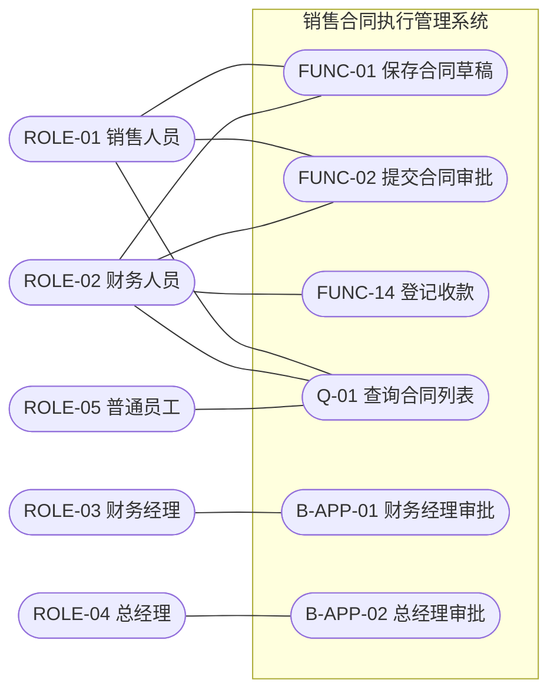
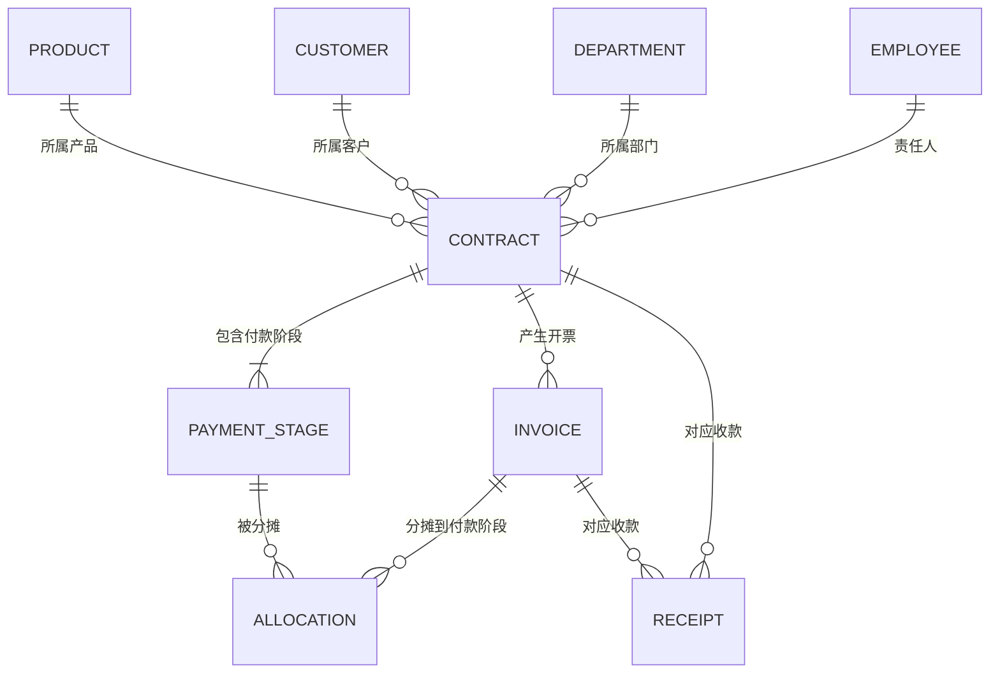
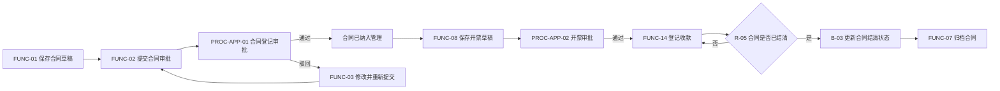
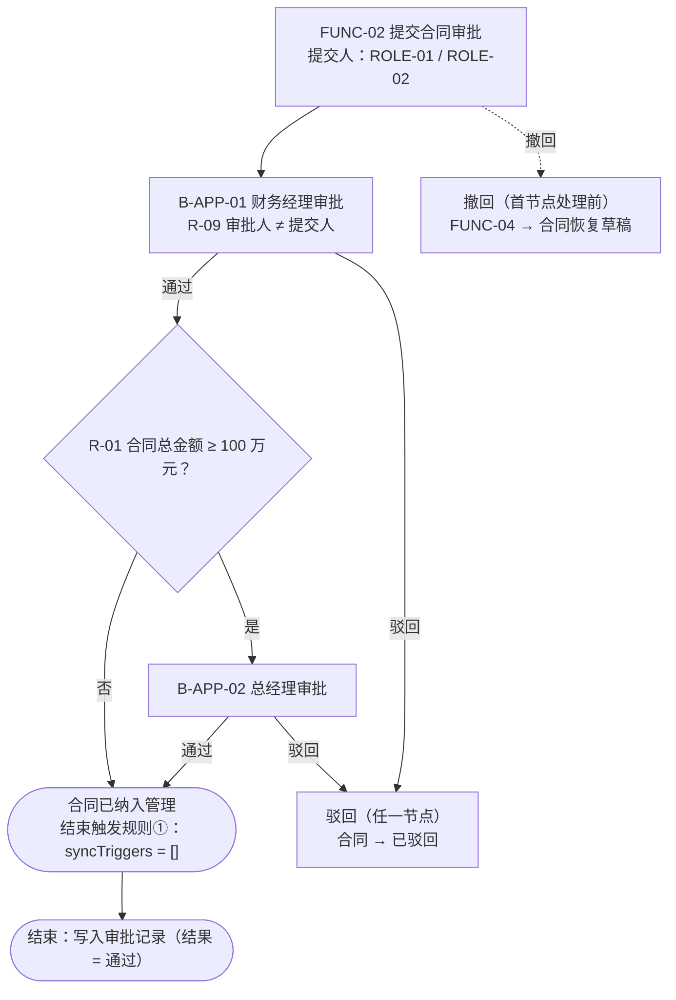

> 本文件由《AI 需求探索与确认提示词 V10.0》的**附录一（《软件需求编写规范 V10.0》全文）**与**附录二（示例片段）**合并而成。
> 它是最终需求文档的**唯一**格式、编号、模板、图表与自检基准，其中的强制条款不得省略、不得降级为参考资料。

# 附录一：《软件需求编写规范（V10.0）》全文

> 本附录是本提示词最终输出需求文档时必须遵循的规范模板。以下内容完整合并自《软件需求编写规范 V10.0》，不得省略其固定结构、模板、编号体系和自检要求。

# 软件需求编写规范（V10.0）

| 项目 | 内容 |
|---|---|
| 文档名称 | 软件需求编写规范 |
| 版本 | V10.0 |
| 适用范围 | 单体同步部署的中小型企业应用软件需求规格说明书的编制（AI 需求探索产出与人工编写通用） |
| V10.0 关键改进 | ① 文档结构由「三大部分 + 附录 C」改为「**九部分 + 附录 A**」，业务对象与业务功能章节互换顺序；② 新增第六部分（主数据维护）、第七部分（数据字典定义）、第八部分（UI 菜单规划与权限）、第九部分（UI 原型）四个部分；③ 新增 1.6 技术底座与运行前置、3.5 统一编号生成规则两个强制小节；④ 删除原附录 C 七模型建模输入基线；⑤ UI 原型由可选补充交付物升为固定结构的一部分，每个菜单定义域固定 7 个子条；⑥ 自检清单由 47 项重排为 **54 项**，并按九部分结构重新分组 |
| 继承的 V9.0 改进 | 单体同步取向，移除事件（E-xx）、场景（SCN-xx）、接口（INT-xx）三类编号与对应章节；跨对象影响统一以「跨对象联动」（M2 `syncTriggers` + M3 规则）表达；所有端到端流程与审批流强制 Mermaid 流程图；强制对象关系 ER 图与角色-功能业务用例图；REF / INV / R 三层规则归属唯一 |
| 配套使用 | 本规范与《AI 需求探索与确认提示词 V10.0》的阶段零至阶段七配合使用；规范定义最终需求文档的固定结构、模板、编号体系与验收标准 |

---

## 1 目的与适用范围

本规范定义软件需求规格说明书的统一结构、编号体系、编写要求、可视化要求与完整性自检清单，确保：

1. 不同项目输出的需求文档具有基本一致的格式、目录、表格和模板；
2. 需求文档可直接为《ontology_modeling_framework_v9.md》规定的 M1、M2、M3、M5、M6、M7、MU 七类模型提供确定性输入；
3. 规则、流程、联动、行为、报表、角色、编号等跨章节引用全部可追踪；
4. 业务专家可以通过端到端流程图、业务用例图、ER 图和界面原型快速核对业务全貌；
5. 需求文档中「能变成一行代码、一条配置或一条校验判断」的内容集中一处、唯一权威，其余内容外置到《编制说明》。

适用于：

- AI 主导需求探索流程（阶段零至阶段七）的最终产出；
- 业务分析师人工编写、评审或修订需求文档；
- 需要继续生成本体模型、领域模型或实现规格的企业应用项目。

## 2 总体编写原则

### 2.1 业务语言原则

正文使用业务人员可理解的语言。实体、聚合、联动、规则模型等建模术语仅在需要说明规则归属时使用，不得用技术术语替代业务事实。

### 2.2 规则归属唯一性原则

每条业务规则必须且只能归属一个层级，禁止重复建模：

| 层级 | 编号前缀 | 判定标准 | 归属位置 |
|---|---|---|---|
| 属性级规则（refRules） | REF-xx | 只依赖单个属性值 | 第二部分对象属性表的"说明 / 约束"列 + 第三部分 3.3.1 |
| 对象级不变量（invariants） | INV-xx | 只依赖同一对象或聚合内部 | 第二部分对象章节的"对象级不变量"+ 第三部分 3.3.2 |
| 跨对象规则（M3） | R-xx | 跨独立对象、依赖行为结果或需独立复用 | 第三部分 3.3.3，由行为直接调用或经同步联动调用 |

### 2.3 稳定编号与引用原则

文档内一切跨章节引用必须使用稳定编号，禁止只使用名称或"自动联动""进入后续流程"等自由文本。

| 内容 | 编号示例 |
|---|---|
| 业务功能点 | FUNC-01 |
| 自动行为 / 审批行为 | B-01、B-APP-01 |
| 查询行为 | Q-01 |
| 属性级规则 | REF-01 |
| 对象级不变量 | INV-01 |
| 跨对象规则 | R-01 |
| 端到端协同流 | PROC-01 |
| 审批流 | PROC-APP-01 |
| 查询统计与固定报表 | REP-01 |
| 角色 | ROLE-01 |
| 菜单 / 屏幕 | `menu-<一级>-<二级>` / `frmXxx` |
| 数据字典类别 | DICT-XXX |

编号一经分配不得重用。名称或语义调整时保留编号，并在修订记录中说明。

### 2.4 UI 无关原则

业务正文（第一部分至第八部分）只保留业务能力、业务输入、业务结果和业务约束。**例外**：查询条件、结果列、排序、分页及导出属于 M7 业务查询规格，保留；校验时机属于业务约束，保留；编号规则属于业务口径，保留。仅页面配色、字体、间距、组件视觉规范等纯视觉内容剥离，由《UI-UE界面设计规范》统一规定。

### 2.5 确认状态原则

AI 探索产出的内容使用以下状态标记：

- `[AI自动补全]`：基于通用业务知识补全，尚未被用户修改；
- `[已确认]`：用户明确确认或按用户意见修订；
- `[待确认]`：企业专属口径尚未获得明确答复，必须进入待澄清清单。

只有待澄清清单不存在 `[待确认]` 条目且自检全部通过，文档才能标记为"完整（可进入本体建模阶段）"。

### 2.6 Mermaid 可视化统一原则

1. 所有图必须以可复制、可渲染的 Mermaid 代码块输出，禁止只提供截图、外链或自然语言替代；
2. 端到端流程与审批流使用 `flowchart LR` 或 `flowchart TD`；角色到功能业务用例图使用兼容性更好的 `flowchart LR`，不得使用 Mermaid 未普遍支持的 `usecaseDiagram`；对象关系使用 `erDiagram`；
3. 图中节点必须优先标注稳定编号和业务名称，如 `FUNC-01 合同维护`、`R-01 合同审批层级判定`；
4. Mermaid 节点 ID 使用 ASCII 字母、数字和下划线，显示文本可使用中文；
5. 图必须与对应表格语义一致。表格是完整定义，图用于整体理解；二者冲突时视为需求缺陷，必须修正；
6. 无真实业务内容时不得虚构图中节点。确实不存在审批流或跨对象联动时，必须明确写"不适用"及判定理由；
7. 图中不得混入页面、按钮、数据库表、消息中间件等实现细节；
8. **本规范不要求状态迁移图**：对象状态及其流转以第七部分状态字典的「进入该状态的触发功能点 / 行为」列表达。

### 2.7 V10.0 关键约定（强制条款）

1. **技术底座前置**：1.6 必须声明技术底座情形（已指定 / 未指定），未指定时必须写出降级实现（仅用户登录 + 默认账号；不做角色权限管理；不做流程引擎）；
2. **编号统一**：3.5 必须给出全部系统生成编号的统一格式与规则明细，其他章节一律引用 3.5，不重复描述格式；
3. **字段级唯一权威**：第九部分每个定义域的子条 2「界面元素表」是全文唯一的字段级清单，其他位置不得再列字段定义；
4. **两档校验**：3.4 必须区分「保存松」与「提交严」，并写明不通过时的系统行为；
5. **对象定义体现属性级规则**：对象属性表必须引用对应 REF 编号并简述规则；
6. **功能详述规则列收敛**：功能详述的"涉及规则"只允许 INV 与 R，每条一行，使用"编号 + 名称"；
7. **联动分类铁律**：界面事件联动只入第九部分子条 7；跨对象联动只入 M2 `syncTriggers`；流程启动只入 M6 `trigger.behaviorRef`；流程启动不写入 `syncTriggers`；
8. **审批流必含「结束触发规则」**：按末节点通过 / 驳回 / 撤回 / 环节结束但流程未结束四种情形分别声明；
9. **UI 原型为固定结构**：第九部分按菜单逐域展开，每域固定 7 个子条，缺一不可；
10. **正文与《编制说明》分工**：文档元信息、编写规则、背景性内容、自证核对记录一律外置，正文只留原编号 + 一句话指向。

## 3 编号体系

### 3.1 文档内规则与行为编号

| 编号前缀 | 层级 / 元素 | 命名规则 | 示例 |
|---|---|---|---|
| REF-xx | 属性级规则 | 按对象出现顺序全局编号 | REF-01 合同总金额必须为正 |
| INV-xx | 对象级不变量 | 全局编号 | INV-01 采购金额不超过合同金额 |
| R-xx | 跨对象规则 | 全局编号 | R-01 合同审批层级判定 |
| FUNC-xx | 人工业务功能点 | 按菜单域顺序全局编号 | FUNC-01 保存合同草稿 |
| B-xx | 系统自动行为 | 全局编号 | B-01 更新付款阶段开票状态 |
| B-APP-xx | 审批节点行为 | 全局编号 | B-APP-01 财务经理审批 |
| Q-xx | 查询行为 | 与 REP 一对一 | Q-01 查询合同列表 |
| PROC-xx / PROC-APP-xx | 流程 | 全局编号 | PROC-01 / PROC-APP-01 |
| REP-xx | 查询报表 | 全局编号 | REP-01 合同综合查询 |
| ROLE-xx | 角色 | 全局编号 | ROLE-01 销售人员 |

约束：

- 功能描述引用规则时必须使用"编号 + 名称"；
- 属性级表达式统一用 `value` 表示当前属性值；
- 同一规则不得同时以 REF、INV、R 多种形式出现；
- 一个按钮若对应多个业务后果出口（如审批通过 / 驳回），复用同一编号。

### 3.2 业务对象的系统生成编号（3.5 的强制内容）

业务数据编号统一为「**对象英文三位缩写（大写）+ `-` + YYYYMMDD + `-` + 4 位流水号**」：

| 对象 | 三位缩写 | 编号格式 |
|---|---|---|
| Contract | `CON` | `CON-YYYYMMDD-NNNN` |
| Invoice | `INV` | `INV-YYYYMMDD-NNNN` |
| Receipt | `REC` | `REC-YYYYMMDD-NNNN` |
| ApprovalRecord | `APR` | `APR-YYYYMMDD-NNNN` |
| Product | `PRO` | `PRO-YYYYMMDD-NNNN` |
| Customer | `CUS` | `CUS-YYYYMMDD-NNNN` |
| Department | `DEP` | `DEP-YYYYMMDD-NNNN` |
| Employee | `EMP` | `EMP-YYYYMMDD-NNNN` |

约束：

- 缩写取对象**英文名**前三字母并大写，不使用拼音缩写；
- 流水号按「缩写 + YYYYMMDD」分段独立计数、按日重置；保存时分配，生成后只读；
- 并发取号必须由统一取号机制保证唯一，禁止"先查询最大值再 +1"；4 位用尽时报错，不回绕、不复用；
- 审批记录取 `APR`（唯一例外），因 `APP` 已占用为审批行为编号命名空间；
- 从属明细与关联对象不单独编号，用"所属单据 + 行内顺序号"或"两侧对象联合唯一"标识；
- 对象属性表与界面元素表一律引用 3.5，不重复描述格式。

## 4 文档固定结构总览

最终需求规格说明书必须使用以下结构。没有适用内容的章节不得删除，应写明"不适用"及理由。

```text
第一部分 项目概述与范围
  1.1 系统定位（一句话 + 不管理什么）
  1.2 业务范围（1.2.1 范围内 / 1.2.2 范围外 / 1.2.3 外部边界）
  1.3 业务域划分
  1.4 核心清单索引（指向各章清单表，不重复汇总）
  1.5 角色总览
  1.6 技术底座与运行前置（1.6.1 情形一 / 1.6.2 情形二降级 / 1.6.3 与其余部分的关系）
第二部分 业务对象
  2.1 ~ 2.n 逐个对象：业务定义 + 属性表（六列）+ 对象级不变量
  2.n+1 对象关系总览（Mermaid ER 图 + 关系说明与引用失效策略表）
第三部分 业务功能与规则
  3.1 功能点清单（3.1.1 清单表 / 3.1.2 功能点编号口径 / 3.1.3 角色-功能业务用例图 / 3.1.4 用例图覆盖说明）
  3.2 功能点详述（3.2.1 业务单据类逐个详述 / 3.2.2 主数据·字典·查询·审批·自动行为矩阵化详述）
  3.3 业务规则（3.3.1 REF / 3.3.2 INV / 3.3.3 R / 3.3.4 规则归属口径）
  3.4 校验时机：保存松、提交严
  3.5 统一编号生成规则（3.5.1 规则明细）
第四部分 流程定义
  4.1 端到端协同流程定义（每条：概述表 + 业务阶段与步骤表 + Mermaid 流程图）
  4.2 审批流程定义（每条：审批要素表含「结束触发规则」+ Mermaid 流程图）
  4.3 流程一致性核对（结论外置，正文一句指向）
第五部分 查询统计与报表
  5.1 总览（编号 / 名称 / 类型 / 主要来源 / 唯一查询行为 / 所在菜单）
  5.2 ~ 5.n 每个报表一节（9 项定义表）
  5.n+1 查询行为绑定总览（结论外置，正文一句指向）
第六部分 主数据维护
  6.1 主数据清单与统一维护规则（6.1.1 统一维护规则）
  6.2 各主数据的权威定义位置
  6.3 引用失效与删除策略总表
第七部分 数据字典定义
  7.1 字典清单
  7.2 ~ 7.n 逐类字典明细（状态类字典第 5 列为「进入该状态的触发功能点 / 行为」）
  7.n+1 字典使用与引用约束
第八部分 UI 菜单规划与权限
  8.1 菜单规划（8.1.1 菜单树 / 8.1.2 菜单-屏幕定义表）
  8.2 菜单-屏幕-对象依赖与 CUD 操作总览（可降级为索引）
  8.3 菜单可见性权限矩阵（矩阵一）
  8.4 菜单-业务功能点对应表
  8.5 功能点可操作性权限矩阵（矩阵二）
  8.6 权限一致性核对 + 权限范围外声明
第九部分 UI 原型（按菜单逐域展开，每域固定 7 个子条）
  9.0 UI 原型交付说明与联动边界
  9.1 ~ 9.n 逐个定义域（标题：9.x.y 二级菜单名（菜单 menu-* ｜ 屏幕 frmXxx））
附录 A 术语表
```

> 《编制说明》是与本文档**并行交付**的配套文件（不属于正文结构），收纳：A 编制依据与版本记录 / B 编写约定 / C 背景性内容 / D 自证性核对记录 / E 质量记录与交付物（待澄清清单、自检报告、修订记录）。

## 5 第一部分：项目概述与范围

### 5.1 系统定位

一到两句写明系统管理什么、从哪个环节开始、**不管理什么**。项目背景、痛点与建设目标外置到《编制说明》。

### 5.2 业务范围

- **5.2.1 范围内**：四段式，分别写业务能力 / 界面能力 / 数据能力 / 权限能力；
- **5.2.2 范围外**：表格「范围外内容 | 排除理由」，与平台能力相关的一律注明"由技术底座提供（见 1.6）"；
- **5.2.3 外部边界**：列表，写明主数据是否本系统维护、是否存在外部接口。

### 5.3 业务域划分

| 业务域 | 说明 | 承载对象 |
|---|---|---|
| …… | …… | …… |

### 5.4 核心清单索引

用一段话指向各章的清单表（对象见 2.x、功能点见 3.1.1、规则见 3.3、菜单见 8.1.2），**不在此处重复汇总**。

### 5.5 角色总览

| 角色 ID | 角色 | 一句话职责 |
|---|---|---|
| ROLE-xx | …… | …… |

注明：角色是岗位定义，角色与人员的绑定、权限配置由技术底座维护。

### 5.6 技术底座与运行前置（强制）

- **1.6.1 情形一：技术底座已就绪**：表格「底座能力 | 底座已提供的内容 | 本需求如何使用」，覆盖用户登录、系统管理（用户 / 角色 / 权限 / 资源 / 菜单）、流程引擎（流程设计 / 活动 / 参与人角色配置 / 流程执行 / 流程任务查询）三类；
- **1.6.2 情形二：未指定技术底座时的降级实现**：表格「能力项 | 降级实现（要做） | 不实现（不做）」，四项：用户登录（仅用户名、用户密码、人员编码、状态）、默认登录账号（`admin`，强制首次登录修改）、角色权限管理（不实现）、流程引擎（不实现，审批降级为单据状态流转 + 审批记录）；
- **1.6.3 与本文其余部分的关系**：表格「本文位置 | 情形一 | 情形二」，至少覆盖人员对象、审批流程、菜单规划、权限矩阵四处。

## 6 第二部分：业务对象

### 6.1 对象定义与属性表（强制模板）

每个对象一节，先给业务定义（一段）与确认标记，再给属性表。**六列不可省略**：

| 属性 | 属性英文名 | 类型 | 必填 | 唯一 | 说明 / 约束 |
|---|---|---|---|---|---|
| …… | codeIdentifier | 字符串 / 金额 / 小数 / 百分比 / 日期 / 日期时间 / 数据字典 / 布尔值 / 引用 | 是 / 否 | 是 / 否 / 联合唯一 | 业务口径；REF-xx；相关 INV-xx；引用目标；字典类型编码 |

"说明 / 约束"列必须：

1. 描述金额、税率、比例、时间等业务口径；
2. 编号属性写明「按 3.5 规则生成并只读」；
3. 引用该属性对应的 REF 编号并简述结论；
4. 状态属性写明"字典类型编码 + 只能由 B-xx 更新 + 禁止人工直改"；
5. 引用其他对象时说明引用目标与业务含义。

### 6.2 对象级不变量

对象章节末尾用两列表列出该对象或聚合的 INV：不变量编号｜业务条件（并标注校验强度：保存即校验 / 仅提交时强制校验）。跨对象约束仅标注"归属 R-xx，见 3.3.3"。

### 6.3 对象关系总览（强制）

- 一张 Mermaid `erDiagram`，覆盖全部核心对象、明细对象、关联对象与被本系统引用的重要主数据；
- 一张关系说明与引用失效策略表：**源对象 | 关系 | 目标对象 | 基数 | 承载方式 | 删除 / 作废 / 历史策略**；
- 多对多关系必须通过关联对象显式表达；ER 图只表达静态业务关系，不混入流程、角色或页面。

> 不输出状态迁移图；状态流转由第七部分状态字典的触发列表达。

## 7 第三部分：业务功能与规则

### 7.1 功能点清单（3.1.1）

| 编号 | 功能点名称（按钮文案） | 所属菜单 | 操作角色 | 功能点类型 | 主操作对象 | 触发联动（syncTriggers） |
|---|---|---|---|---|---|---|

`触发联动` 列是 3.2 各功能点详述与自动行为表的索引，取值形如「无」「R-01 → B-02」「流程启动由 PROC-APP-01 承载」。

### 7.2 功能点编号口径（3.1.2）

明确列出"占编号"与"不占编号"的交互：

| 判定维度 | 占功能点编号 | 不占功能点编号 |
|---|---|---|
| 是否触发独立业务行为 | 是：点击后产生独立的对象状态变更、新增、删除或流程启动 | 否：仅前端交互，不产生业务对象变化 |
| 具体例子 | 保存草稿、提交、重新提交、撤回、删除、作废、归档、冲销、审批通过 / 驳回、查询、新增 / 修改 / 停用启用 / 删除（主数据） | 网格添加行 / 删除行、取消、退出、重置、导出、每页条数、分页、弹窗内取消 |
| 审批双按钮 | 「审批通过」与「驳回」复用同一 `B-APP-xx` 编号 | — |
| 同一按钮的两种状态 | 「提交」与「重新提交」是两个功能点（前置状态不同、对应行为不同） | — |
| 主数据 CRUD | 四个动作各自独立编号，且每个对象独立编号 | 弹窗内「取消」 |

### 7.3 角色-功能业务用例图（3.1.3，强制）

- 在功能点清单后输出一张 Mermaid 业务用例视图，统一使用 `flowchart LR`；
- 覆盖所有人工角色与所有人工可执行的 FUNC / Q / B-APP 行为；自动行为不得连接人工角色；
- 功能较多时允许按业务域拆成多张图，但必须另给覆盖表证明无遗漏（覆盖说明外置到《编制说明》）；
- 角色名称与 1.5 一致；用例编号与 3.1.1、3.2、8.5 一致。

### 7.4 功能点详述（3.2，强制模板）

**业务单据类**（3.2.1）逐个详述，每个功能点一张表，字段固定：

| 项目 | 内容 |
|---|---|
| 所属菜单 / 按钮 | 一级菜单 / 二级菜单 → 界面区域「按钮文案」 |
| 操作角色 | 角色名，或"系统自动" |
| 主操作对象 | 对象名称（含聚合内明细） |
| 前置条件 | 状态或数据前提 |
| 操作步骤 | 编号步骤；流程调用写"启动 PROC-APP-xx" |
| 涉及规则 | **仅 INV-xx 与 R-xx**；每条一行"编号 + 名称"；无则写"无" |
| 校验时机 | 保存（松校验）：列出具体 REF / INV 编号；提交（严校验）：全部 REF + 全部 INV + 相关 R |
| 后置状态变更 | 明确对象状态或数据变化（写明字典编码）；无则写"无" |
| 触发联动 | `R-xx → B-xx`（规则介入）或 `B-xx`（无条件）；流程启动写"启动 PROC-APP-xx，syncTriggers 为 []"；无则写"无" |
| 对应 M2 行为 | 行为英文名（类型 / 触发方式） |

**主数据、字典、查询、审批与自动行为类**（3.2.2）按矩阵化表格详述，不逐条铺开：

| 分组 | 表格列 |
|---|---|
| （1）主数据维护功能点组 | 对象｜新增｜修改｜停用 / 启用｜删除｜共同前置条件 / 规则 / 后置状态 |
| （2）数据字典维护功能点组 | 编号｜功能点（按钮）｜前置条件 / 规则 / 后置状态 |
| （3）查询功能点 | 编号｜按钮 / 入口｜绑定报表对象｜操作角色与数据范围 |
| （4）审批行为 | 编号｜名称（按钮）｜前置条件｜处理｜后置状态 / 触发联动 |
| （5）系统自动行为（人工不可直接触发） | 编号｜名称｜触发时机｜处理｜后置状态 / 继续联动 |

**强制约束**：

- REF 不得在"涉及规则"重复列出；
- 后置状态变更与触发联动必须分开；
- 查询功能必须与唯一 `Q-xx` / `REP-xx` 对应，且不产生业务状态变化；
- 校验时机必须逐功能点写明，不得只写"见 3.4"。

### 7.5 业务规则章节（3.3）

| 小节 | 表格列 |
|---|---|
| 3.3.1 属性级规则 REF | 编号｜所属对象.属性｜规则名称｜表达式（`value` 为当前值）｜违反提示｜执行时机 |
| 3.3.2 对象级不变量 INV | 编号｜所属对象｜规则名称｜业务条件｜校验时机 |
| 3.3.3 跨对象规则 R | 编号｜名称｜规则类型｜业务判断｜输入来源｜输出结果｜被调用 |
| 3.3.4 规则归属口径 | 一段话：REF 入 M1 `refRules`、INV 入 M1 `invariants`、R 入 M3；三者不互相搬运；并给出各自条数 |

### 7.6 校验时机：保存松、提交严（3.4，强制）

| 档位 | 触发按钮 | 校验对象 | 校验内容 | 不通过时的系统行为 |
|---|---|---|---|---|
| 松校验 | 保存草稿 | 当前录入内容（草稿态） | 全部 REF（已录入属性）+ 结构性 INV | 阻断保存并逐条提示违反的规则编号与提示语；草稿允许录入不完整，但不得违反已录入数据的结构性约束 |
| 严校验 | 提交 | 聚合完整性 | 全部 REF + 全部 INV + 相关 R | 阻断提交并逐条提示；提示语必须给出具体缺口（如"付款比例合计为 96%，需等于 100%"） |
| 严校验 | 无草稿态的直接生效操作（如登记收款）/ 冲销 / 作废 / 归档 / 删除 / 审批 | 目标单据及下游凭证 | 全部 REF + 相关 INV + 资格类 R | 阻断操作并说明不满足的资格条件 |

并注明：状态类属性由系统生成或由行为赋值，界面以只读展示，**不参与用户输入校验**。

### 7.7 统一编号生成规则（3.5，强制）

按 3.2 节的口径输出：

- 一张对象编号表：**对象｜属性（英文名）｜对象英文名｜三位缩写｜编号格式｜示例**；
- 3.5.1 规则明细表：规则项｜口径。至少覆盖：三段含义、缩写取值、例外登记、生成时机、流水号范围与重置、唯一性与并发、与文档内规则编号的命名空间区别、不适用对象；
- 一段说明：本规则覆盖全文所有"系统生成并只读"的编号属性，其他章节一律引用本节。

## 8 第四部分：流程定义

### 8.1 端到端协同流程定义（4.1）

每条 `PROC-xx` 一节，包含三部分：

**① 流程概述表**：流程编号 / 名称｜流程类型（`COLLABORATION`）｜业务目标｜业务对象范围｜开始条件｜结束条件｜业务阶段｜调用（其他流程编号）｜流程启动触发器（`trigger.behaviorRef`）

**② 业务阶段与步骤表**：

| 环节 | 业务活动 | 执行功能点 / 行为 | 操作对象 | 执行角色 | 引用 |
|---|---|---|---|---|---|

必须覆盖正常路径、主要业务分支、驳回 / 退回、异常终止或重新提交路径。等待态可写"无状态变更（等待态）"。查询类能力只能标注为贯穿能力。

**③ Mermaid 流程图**：每条流程一张独立图，用 `flowchart LR`，体现开始、结束、主要活动、关键网关、审批子流程与回退路径。

### 8.2 审批流程定义（4.2）

每条 `PROC-APP-xx` 一节，要素表固定为：

审批对象｜提交人｜提交条件｜启动触发器（`trigger.behaviorRef` 指向的行为编号）｜第一节点｜分级条件（引用的 R 编号）｜第二节点（如有）｜节点关系（串行 / 并行 / 会签 / 或签 / 条件加签，并给出"已确认"结论）｜职责分离（引用的 R 编号）｜通过结果｜驳回结果｜撤回结果｜重新提交｜终止条件｜**结束触发规则**

**结束触发规则**必须按四种情形分别写明（是否触发规则处理、触发哪条规则 / 行为、`syncTriggers` 具体取值）：

1. 末节点审批通过（流程正常结束）；
2. 任一节点驳回（流程异常结束）；
3. 首节点处理前撤回（流程提前结束）；
4. 环节结束但流程未结束（如多级审批的第一级通过后流转下一节点）。

之后给一张独立 Mermaid 流程图（建议 `flowchart TD`）。审批人必须使用角色编号，不绑定具体姓名或用户 ID。若不存在审批流，应列明已核对的核心单据及"不需要人工审批"的确认结论。

### 8.3 流程一致性核对（4.3）

正文保留小节编号与一句话指向《编制说明》；核对项至少包括：流程图中的活动、网关、子流程均有稳定编号及正文定义；每条流程均可达结束状态且回退路径无死循环；审批节点角色已在第八部分定义并具备权限；状态字典的触发列与功能点后置状态一致；同一业务判断在流程网关与 M3 中使用同一 R 编号。

## 9 第五部分：查询统计与报表

### 9.1 总览（5.1）

| 编号 | 名称 | 类型 | 主要来源 | 唯一查询行为 | 所在菜单 |
|---|---|---|---|---|---|

### 9.2 每个报表一节（5.2 ~ 5.n）

定义表字段固定为：业务目的｜对象类型 / 来源对象｜关联条件｜输入查询条件｜结果列｜计算列｜分组汇总｜默认排序 / 分页 / 导出｜唯一查询行为。

**强制要求**：

- 每个正式 `REP-xx` 与唯一 `Q-xx` 一对一绑定；
- 查询条件和聚合公式直接属于 M7，不为复用而外挂 M3；
- 多个一对多明细共同聚合时，先按关联键分别汇总再关联，避免笛卡尔乘积造成金额重复；
- 分页给默认每页条数与可选值；导出给格式清单（XLSX / CSV / PDF）；
- 原始需求未明确查询报表时，AI 至少建议 2 个有业务价值的候选项并请用户确认；
- M7 不承载 BI 指标平台、事实表、维度表、宽表、Cube、ETL 或数据行级权限。

### 9.3 查询行为绑定总览（5.n+1）

正文保留编号与一句指向《编制说明》；核对表为「REP 对象 | 唯一 M2 QUERY 行为 | 一致性结果」。

## 10 第六部分：主数据维护

### 10.1 主数据清单与统一维护规则（6.1）

| 主数据 | 对象英文名 | 菜单 / 屏幕 | 功能点 | 维护角色 | 操作对象（CUD） |
|---|---|---|---|---|---|

**6.1.1 统一维护规则**（规则项｜内容），逐项覆盖：新增、修改、停用 / 启用、删除、唯一性、是否需要审批、是否产生联动、列表查询。

### 10.2 各主数据的权威定义位置（6.2）

用一段话指明：对象属性见第二部分对应小节；字段级定义与界面形态见第九部分对应界面元素表；不做重复定义。

### 10.3 引用失效与删除策略总表（6.3）

| 主数据 | 被谁引用 | 删除条件 | 停用后的效果 | 历史数据表现 |
|---|---|---|---|---|

统一口径：被任意业务对象引用后不可删除，只能停用；停用后历史数据仍正常展示，但不允许新引用。

## 11 第七部分：数据字典定义

### 11.1 字典清单（7.1）

| 数据字典类别编码 | 类别名称 | 字典项数 | 是否状态字段 | 被引用的属性 |
|---|---|---|---|---|

状态字段行须醒目标识（如黄底）。

### 11.2 逐类字典明细（7.2 ~ 7.n）

普通字典：**字典编码｜字典值（显示文本）｜显示顺序｜启用｜说明**。

**状态类字典**：第 5 列改为「**进入该状态的触发功能点 / 行为**」；如该状态由规则判定进入，则写「判定口径」并引用 R 编号与行为编号。这是状态流转信息的唯一权威位置。

### 11.3 字典使用与引用约束（7.n+1）

| 约束项 | 内容 |
|---|---|

至少覆盖：三级表达（类别编码 → 字典编码 → 字典值）、业务数据存 code 界面显示 label、字典编码不可修改、已被引用的字典项只能停用不能删除、状态类字典取值只能由行为赋值、运行期能否新增字典类别、字典维护的角色限定。

## 12 第八部分：UI 菜单规划与权限

### 12.1 菜单规划（8.1）

- **8.1.1 菜单树**：固定两级（一级菜单 → 二级菜单）；
- **8.1.2 菜单-屏幕定义表**：菜单 ID｜一级菜单｜二级菜单｜屏幕 ID / 屏幕名称｜屏幕类型｜布局要点。

屏幕类型取值：`SINGLE_FORM` / `LIST_MAINTENANCE` / `MASTER_DETAIL_FORM` / `QUERY_LIST`。

### 12.2 菜单-屏幕-对象依赖与 CUD 操作总览（8.2）

可以表格列出「菜单 | 屏幕 | 依赖对象 | 读取 / Create / Update / Delete | 挂接流程」；若已在第九部分各域子条 3 逐域给出，本处可降级为**索引**（列表头 + 一句"逐域明细见第九部分各定义域子条 3"，明细外置到《编制说明》）。

### 12.3 菜单可见性权限矩阵（8.3，矩阵一）

行＝二级菜单，列＝角色，取值「可见 / —」。并注明本矩阵是**技术底座角色配置的输入**。

### 12.4 菜单-业务功能点对应表（8.4）

菜单｜屏幕｜该菜单下的功能点清单与数量。若已在 3.1.1 的「所属菜单」列逐条表达，本处可降级为索引。

### 12.5 功能点可操作性权限矩阵（8.5，矩阵二）

行＝功能点 / 行为，列＝角色（含系统自动执行主体）。权限目标必须是 M2 行为；查询权限绑定 `Q-xx` 不绑定 `REP-xx`；**自动行为只授予系统自动执行主体**。

### 12.6 权限一致性核对与范围外声明（8.6）

- 核对结论外置到《编制说明》；
- 正文保留**权限范围外声明**一句话：用户账号管理、角色配置、人员与角色绑定，以及流程引擎自身能力，由技术底座提供（见 1.6）。

## 13 第九部分：UI 原型（按菜单逐域展开）

### 13.1 交付说明与联动边界（9.0）

声明：交付形态（本文件 HTML + 可运行原型文件）、样式基准（《UI-UE界面设计规范》）、布局表达（**真实静态界面原型**——以 ` ```html ` 围栏内的 `.mock` 结构装配，由转换器原样渲染，**不使用 ASCII 字符框图，也不使用「区域-行-单元格」的表格说明**，装配规范见《UI-UE界面设计规范》第 16 章）、控件类型映射、审批双按钮、字段级唯一权威清单、三类联动铁律、两档校验强度。

**控件类型映射（强制）**：日期 / 日期时间 → 日期控件；枚举 / 数据字典 → 下拉列表框；对象引用 → 跳选框；长文本 / 备注 → 多行文本域；布尔 → 复选框；数字 / 金额 → 数字框；明细 / 结果 → 表格；按钮 → 按钮。

**HTML 渲染口径（转换器自动处理）**：

- 行内编号 `FUNC-` / `REF-` / `INV-` / `R-` / `REP-` / `B-APP-` / `ROLE-` 等自动渲染为彩色胶囊（`.id`），便于阅读时快速定位引用；
- 列数 ≥ 8 的表格自动加 `.wide`（最小宽度 1180px，允许横向滚动）；列数 5~7 且列头文字较长时自动加 `.mid`（最小宽度 980px）；
- 界面原型片段使用 ` ```html ` 围栏原样透传，不转义，片段内不得再写 `<style>` 或引用外部资源。

### 13.2 每个定义域的固定 7 个子条（强制）

一个二级菜单 = 一个定义域。**7 个子条缺一不可，顺序固定**：

| 序号 | 子条 | 内容要求 |
|---|---|---|
| 1 | UI 界面说明 | **三件套 = 引导句 + ` ```html ` 原型块 + 图注**，缺一不可。① **子条标题**必须写成 `### 9.x.1 UI 界面说明`（点号三级；写成 `### （1）…` 或 `####` 会产出中文锚点、目录与交叉引用失效）；② **引导句**位于围栏之前，句式 `界面原型（<形态标识>）：<顶部…>、<中部…>、<底部…>；<关键动作（带编号）>。<设计意图一句>`，**四个必含要素**：形态标识（取《UI-UE界面设计规范》7.1 的 5 类，可带 `·` / `+` 后缀）、空间结构（「顶部 / 中部 / 底部」，**禁止写「N 项条件 / N 列」这类计数**）、关键动作（按钮 / 交互 + `FUNC-xx` / `B-APP-xx` / `Q-xx`）、设计意图（给谁看什么、支持什么判断）；③ **原型块**以 ` ```html ` 围栏内的 `.mock` 结构装配（顶栏标题 + 工具栏 / 查询条件区 + 数据列表 / 表单 + 分页 + 弹窗 + 按钮与状态标签的真实形态），装配规范见《UI-UE界面设计规范》第 16 章，**禁止**用「区域 / 行 / 单元格 1-4」的表格描述控件位置，**禁止** ASCII 字符框图；④ **图注**用 `<p class="fig-cap">` 给一句话关键规则 |
| 2 | 界面元素表 | 字段项｜控件 ID｜对应对象属性｜控件类型｜数据来源类型｜数据源｜默认值｜是否可编辑｜必填｜对应行为 / 说明。**全文唯一字段级权威**；主从表用分组标题行区分「主表字段 / 从表：明细对象名 / 操作按钮」 |
| 3 | 依赖对象与 CUD 操作 | 对象｜读取｜Create｜Update｜Delete｜说明（区分物理删除与逻辑作废 / 冲销） |
| 4 | 授权角色 | 可进入本菜单的角色 + 各功能点按钮的角色可用性 |
| 5 | 流程说明 | 含挂接流程的按钮则说明流程编号、节点、分级条件与结束触发规则；无则写「无」 |
| 6 | 界面初始化说明 | 初始化项｜规则（默认值、初始载入数据、只读 / 可编辑态、编号按 3.5 生成、上下文带值） |
| 7 | 界面事件联动规则 | 序号｜触发字段 / 动作｜联动效果｜边界说明（**不修改任何对象状态**） |

**定义域标题约定**：`9.x.y　二级菜单名（菜单 menu-一级-二级 ｜ 屏幕 frmXxx）`，屏幕 ID 与 8.1.2 完全一致。

### 13.3 强制约束

1. 三类联动必须分清：界面事件联动只入子条 7；跨对象联动只入 3.1.1 / 3.2 / 3.2.2（5）；流程启动只入 4.2；**界面不做任何跨对象写操作**；
2. 带审批的录入界面必须有两个独立按钮功能点（保存草稿 `DRAFT` / 提交 `SUBMIT`）；
3. 字段级定义只在子条 2 出现**一次**；不得另立主表 / 明细表字段清单；
4. 编号一律写"按 3.5 规则自动生成"，不重复描述格式；
5. 每个"不占编号"的交互必须在子条 2 的按钮区逐条标注；
6. 界面原型只表形态，不承载字段语义。

## 14 附录与配套文件

### 14.1 附录 A 术语表（正文附录）

| 术语 | 英文 / 缩写 | 含义 |
|---|---|---|

优先收录企业专属或容易产生歧义的术语（如"有效收款""作废""冲销""技术底座""统一编号规则"）。

### 14.2 必须交付的配套文件《编制说明》

正文中外置的内容统一汇编为《编制说明》，分区：

| 区 | 内容 |
|---|---|
| A 编制依据与版本记录 | 版本演化、各版调整说明、文档固定结构树 |
| B 编写约定 | UI 原型交付说明与联动边界、功能点判定标准、规则归属口径、主数据逐字段说明、菜单依赖与 CUD 总览、菜单-功能点对应表 |
| C 背景性内容 | 项目背景与目标、核心清单总览 |
| D 自证性核对记录 | 用例图覆盖说明、流程一致性核对、查询行为绑定总览、权限一致性核对 |
| E 质量记录与交付物 | 待澄清问题清单、需求完整性自检报告、修订记录、交付物清单 |

正文被外置的小节**保留原编号**，写一句"编号口径属编写规则，见《编制说明》§X。要点：……"，使内部交叉引用零改动。

## 15 需求完整性自检清单（V10.0，54 项）

| 组 | 序号范围 | 主题 |
|---|---|---|
| A | 1 ~ 6 | 范围与结构 |
| B | 7 ~ 14 | 业务对象 |
| C | 15 ~ 22 | 功能点 |
| D | 23 ~ 30 | 规则与校验 |
| E | 31 ~ 36 | 流程 |
| F | 37 ~ 41 | 查询报表 |
| G | 42 ~ 47 | 主数据与数据字典 |
| H | 48 ~ 52 | UI 与权限 |
| I | 53 ~ 54 | 实现前置 |

| 序号 | 自检项 | 通过标准 |
|---|---|---|
| 1 | 系统定位明确 | 写明管理什么、从哪开始、不管理什么；背景性内容已外置 |
| 2 | 业务范围三层齐备 | 范围内（业务/界面/数据/权限能力）、范围外（含理由）、外部边界 |
| 3 | 业务域划分完整 | 业务域与承载对象对应，无遗漏域 |
| 4 | 核心清单索引可用 | 指向各章清单表，数量与正文实际一致 |
| 5 | 角色总览完整 | 含人工角色、审批角色与系统自动执行主体 |
| 6 | 文档固定结构齐备 | 九部分 + 附录 A，无空白章节；不适用章节已说明理由 |
| 7 | 每个对象以六列属性表列出 | 属性 / 英文名 / 类型 / 必填 / 唯一 / 说明约束 |
| 8 | 聚合根与从属明细关系明确 | 明细不可独立存在 |
| 9 | 对象关系有 ER 图与关系说明表 | 覆盖全部对象与主要基数 |
| 10 | 主数据引用失效策略明确 | 何时可删、何时只能停用 |
| 11 | 全部状态类属性纳入数据字典 | 状态取值来自字典类型编码 |
| 12 | 对象级不变量已登记并与对象绑定 | 标注校验强度 |
| 13 | 不存在无界面依赖的孤立对象 | 每个对象至少出现在一个菜单的依赖清单中 |
| 14 | 只读展示型对象的展示位置已明确 | 如审批记录在审批界面历史区展示 |
| 15 | 功能点粒度达到可独立编号 | 人工功能点均为按钮类操作 |
| 16 | 每个功能点有独立且全篇唯一的编号 | 无重复、无跳号 |
| 17 | 菜单与功能点的对应关系可双向追溯 | 8.4 + 3.1.1「所属菜单」列 |
| 18 | 功能点编号口径明确 | 列出占编号与不占编号的交互 |
| 19 | 角色-功能用例图覆盖全部功能点并有逐项核对 | 覆盖说明可回溯 |
| 20 | 业务单据类功能点十项字段齐全 | 含校验时机与触发联动 |
| 21 | 带审批的录入界面具备 DRAFT 与 SUBMIT 两个独立功能点 | 对应两个独立行为 |
| 22 | 网格内按钮与纯前端交互均已登记为「不占编号」 | 各界面元素表按钮区逐条标注 |
| 23 | REF 只依赖单个属性值 | 均有表达式与违反提示 |
| 24 | INV 只依赖同一对象或聚合内部数据 | 均标注校验时机与强度 |
| 25 | R 全部涉及跨对象判断 | 均有输入来源与输出结果 |
| 26 | 同一业务判断未在 REF / INV / R 之间重复定义 | 归属唯一性说明已给出 |
| 27 | 两档校验强度明确 | 松校验与严校验的校验内容逐项列出 |
| 28 | 校验不通过的系统行为明确 | 阻断 + 逐条提示，提示语给出具体缺口 |
| 29 | 规则的反向引用一致 | 每条 R 的调用方可回溯 |
| 30 | 规则编号在界面元素表中可逐条回溯 | 元素表标注 REF / INV / R 编号 |
| 31 | 流程部分只含端到端协同流程与审批流程两类 | 跨对象联动不另立章节 |
| 32 | 每条端到端流程具备概述表、步骤表与独立 Mermaid 图 | 含流程启动触发器 |
| 33 | 每条审批流具备启动触发器、节点、节点关系与职责分离 | 节点使用角色编号 |
| 34 | 每条审批流定义「结束触发规则」并区分通过 / 驳回 / 撤回 / 环节结束 | 四种情形均写出 syncTriggers 取值 |
| 35 | 流程启动不写入 syncTriggers | 启动流程的功能点均标注为由 M6 承载 |
| 36 | 流程一致性核对全部通过 | 含分支可达结束、无死循环 |
| 37 | 全部查询报表集中定义 | 不散落于其他章节 |
| 38 | 每个报表与唯一查询行为严格一对一 | 双向唯一核对 |
| 39 | 每个报表定义九项完整 | 目的 / 来源 / 关联 / 条件 / 结果列 / 计算列 / 分组 / 排序分页导出 / 唯一查询行为 |
| 40 | 多对多明细分别聚合，禁止笛卡尔乘积 | 先汇总再关联 |
| 41 | 界面上的每个查询都能回溯到正式报表对象 | 元素表「数据源」列标注 REP 编号 |
| 42 | 主数据需求单独成部分集中维护 | 清单 + 统一维护规则 + 删除策略 |
| 43 | 四类主数据的统一维护规则明确 | 新增 / 修改 / 停用 / 删除 / 唯一性 / 审批 / 联动 / 列表查询 |
| 44 | 数据字典采用「类别编码 → 字典编码 → 字典值」三级表达 | 业务存 code、界面显示 label |
| 45 | 全部状态字段纳入数据字典管理 | 字典清单标识状态字段行 |
| 46 | 字典编码不可改、已用项停用而非删除、状态值不可人工自由选择 | 7.x 约束表 + 界面警示 |
| 47 | 主数据维护界面采用列表维护布局 | 页面内不出现表单 |
| 48 | 两级菜单规划完整 | 每个二级菜单都有屏幕定义 |
| 49 | 菜单可见性与功能点可操作性分为两张矩阵 | 矩阵一 + 矩阵二 |
| 50 | 菜单的依赖对象、CUD 操作与挂接流程总览完备 | 或已降级为索引并给出明细位置 |
| 51 | 每个菜单一个独立定义域，域内 7 个子条齐备 | 字段清单不重复，只在子条 2 出现一次 |
| 52 | 界面元素表字段齐全、按钮标注行为编码；界面说明为**真实界面原型**（引导句 + 原型块 + 图注三件套齐备） | 数据源区分引用对象与数据字典；子条 1 的**引导句**以 `界面原型（` 开头、形态标识取自 5 类枚举且无自造词、无「N 项 / N 列」计数、有关键动作与设计意图；子条 1 为可直接渲染的 `.mock` / `.mock-modal` 界面原型（非表格说明、非 ASCII 框图）；**载体存在性逐域判断** —— 按 `^## 9\.\d+ ` 切分后，每个定义域内 `class="mock"` 与 `mock-modal` 之和 ≥ 1（**不做全篇等式**：列表维护形态一域内有 `.mock` + `.mock-modal` 两个载体，全篇总数必然大于定义域数；主从表与纯弹窗界面又只有 `.mock-modal`，**也不得按 `.mock` 单独计数**）；转换后无转义残留、h2/h3/h4 中文锚点 = 0、子条 2 与原型字段 / 按钮文案一致 |
| 53 | 技术底座与运行前置已声明，含未指定底座时的降级实现 | 1.6 三小节齐备；降级四项明确 |
| 54 | 系统生成的业务编号口径统一，且全文引用一致 | 3.5 定义 + 全文引用无旧前缀残留 |

**结论判定**：54 项全部通过（不适用项须提供经确认的理由）且待澄清清单无 `[待确认]` 条目时，方可标记文档为"完整（可进入本体建模阶段）"。不适用项必须提供经确认的理由，不能直接删除或默认通过。

---

# 附录二：V10.0 示例片段（以销售合同执行管理为例）

## 示例一：技术底座与运行前置（1.6.1）

| 底座能力 | 底座已提供的内容 | 本需求如何使用 |
|---|---|---|
| 用户登录 | 账号登录、会话维持，当前登录人身份（用户名、人员编码） | 全文「当前登录人」取自底座会话身份，用于登记人 / 登记时间、审批人、提交人职责分离判定与查询数据范围 |
| 系统管理（用户 / 角色 / 权限 / 资源 / 菜单） | 用户维护、角色定义、角色与用户绑定、权限与资源授权、菜单配置与渲染 | 1.5、8.3、8.5 只声明岗位级的可见性与可用性；绑定与实际配置由底座完成 |
| 流程引擎 | 流程定义与设计器、活动与节点、参与人角色配置、流程实例推进、流程任务与待办查询 | 第四部分只声明流程的业务语义；实例推进与待办查询由底座承担 |

## 示例二：统一编号生成规则（3.5）

| 对象 | 属性（英文名） | 对象英文名 | 三位缩写 | 编号格式 | 示例 |
|---|---|---|---|---|---|
| 合同 | `Contract.contractNo` | Contract | `CON` | `CON-YYYYMMDD-NNNN` | `CON-20260914-0001` |
| 开票 | `Invoice.invoiceNo` | Invoice | `INV` | `INV-YYYYMMDD-NNNN` | `INV-20260914-0001` |
| 收款 | `Receipt.receiptNo` | Receipt | `REC` | `REC-YYYYMMDD-NNNN` | `REC-20260914-0001` |
| 审批记录 | `ApprovalRecord.approvalNo` | ApprovalRecord | `APR` | `APR-YYYYMMDD-NNNN` | `APR-20260914-0001` |

## 示例三：角色-功能业务用例图（3.1.3）



## 示例四：整体对象 ER 图（2.11）



## 示例五：端到端流程图（4.1）



## 示例六：审批流图（4.2，含结束触发规则）



---

# 修订记录

| 版本 | 日期 | 修订说明 | 修订人 |
|---|---|---|---|
| V2.0 | 2026-08 | 引入 REF/INV/R 三级规则编号体系；端到端业务流前移；对象定义引用属性级规则；功能描述规则列收敛并强制编号引用 | AI 需求分析师 |
| V3.0 | 2026-08-06 | 强制所有端到端流程与审批流使用 Mermaid 流程图；新增角色-功能业务用例图；强化整体 ER 图；扩展固定目录、附录 C 和自检清单 | AI 需求分析师 |
| V4.0 | 2026-08-21 | 新增阶段八"接口需求探索与确认"（INT-xx）与阶段九"UI 原型探索与确认"；自检清单扩展至 50 项 | AI 需求分析师 |
| V9.0 | 2026-08-29 | 面向单体同步系统裁剪：移除事件（E）、场景（SCN）、接口（INT）编号与对应章节；阶段三改造为"跨对象联动识别与分析"；附录一升级为《软件需求编写规范（V9.0）》全文（七模型基线、47 项自检） | AI 需求分析师 |
| **V10.0** | **2026-09-14** | **以《销售合同执行管理需求规格说明书 V10.4》为反向基准重构**：① 文档结构改为九部分 + 附录 A（业务对象前移、功能与规则后移；新增主数据、数据字典、UI 菜单与权限、UI 原型四个部分；删除附录 C 七模型基线）；② 新增原则五技术底座前置判定（含未指定底座时的四项降级实现）；③ 新增原则六统一编号规则默认口径（三位英文缩写 + YYYYMMDD + 4 位流水）；④ 新增阶段六"主数据与数据字典探索"；⑤ 阶段七重组为"菜单规划、岗位权限与 UI 原型"，UI 原型升为固定结构的一部分（每域固定 7 子条）；⑥ 新增原则八"探索范围＝文档固定结构"及不探索清单；⑦ 规则三层归属与两档校验升格为强制章节；附录一升级为《软件需求编写规范（V10.0）》全文，自检清单重排为 54 项 | AI 需求分析师 |

---

*本规范由 AI 需求探索与确认流程配套维护，版本 V10.0。*
